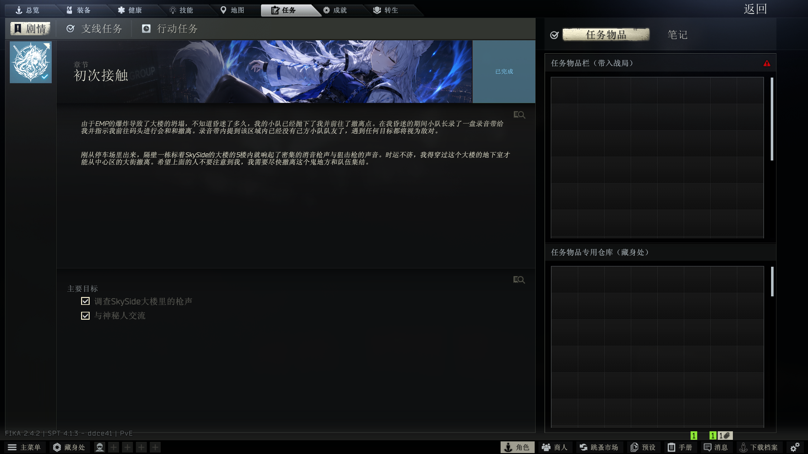

# VisitAPI

**English** | [简体中文](README.zh-CN.md)

An open-source framework that brings EFT 1.x-style trader **Visit** dialogues to SPT — write plain-text `.dlg` scripts to give any trader (including custom traders) a 3D room conversation, story chapters, standing rewards and in-raid dialogue triggers.

> Target: **SPT 4.1.x** (EFT 0.16.9) · Client: BepInEx 5.4.23 plugin (net472) · Server: SPT mod (net10.0) · Fika-compatible



## Features

- **Visit button** — a retail-style "Visit" tab on the trader screen that opens a 3D room conversation
- **Trader rooms** — the seven vanilla traders (Prapor, Therapist, Fence, Skier, Mechanic, Ragman, Jaeger) get their own 3D rooms with lip-sync, animations, ambient audio and the retail loading screen; rooms are a separate download (see Install)
- **.dlg scripts** — nodes, options, condition gates (level / standing / quest state / `ifitems`), branch memory (`set:` / `ifvar:`), one-shot options (`once` / `always` / `first`), image / video / 3D-scene backgrounds, voice + BGM, standing rewards (`standing:`), quest transitions (`accept:` / `complete:` / `handover:` / `setstatus:`)
- **Native narrate pipeline** — vanilla traders run on EFT's built-in visit system with retail dialogue playback (lip-sync, subtitles and branching variables are native)
- **Quest system** — custom quest JSON with fully native network transactions (accept / handover / complete) plus quest image routing
- **In-raid & hideout triggers** — `trigger:` lines place dialogue points at map coordinates (distance + view cone + quest gating), or fire on a timer with `enter <seconds>`; `once` makes a trigger fire only once per profile
- **Native subtitle narration** — `>` narration lines play in the game's own subtitle bar; click or press Space to advance
- **Quest banner** — quest started / ready / completed / failed announced on a retail-style banner riding the vanilla notification pipeline
- **Chapter system (STORY tab)** — the retail 1.1 story page: chapter icon column, banner, main / optional objectives, journal with per-note related items, unread markers, chapter banners and sounds; story quests stay out of the side-quest and trader lists; read state is stored in the profile
- **Progress persistence** — dialogue variables are replayed server-side into the profile and survive across sessions

## Script editor

**[VisitAPI Editor](https://github.com/TricolourSky/VisitAPI-Editor)** is the official companion tool — a local web-based visual editor for `.dlg` scripts and chapter quests. Start there instead of writing scripts by hand.

## Install

1. Grab the packages from [Releases](https://github.com/TricolourSky/VisitAPI/releases):
   - `VisitAPI-x.y.z.zip` — client plugin + server mod + `VisitAPI.Editor.exe`. Extract into your SPT root. The editor lands next to `SPT.Server.exe`; double-click it and it opens in your browser (binds to 127.0.0.1 only).
   - `VisitAPI-x.y.z-TraderRooms.zip` — the 3D trader rooms (about 4.3 GB). Extract into your SPT root. Optional: without it the Visit button only appears for traders that have a `.dlg` script.
2. Put your `.dlg` scripts into `<SPT>\BepInEx\config\VisitAPI\<traderId>.dlg`.
3. The package ships the framework and the retail dialogue data it needs for vanilla-trader playback. It deliberately contains **no** scripts, quests or locale text — only the empty folders they go in.

## Build from source

You need a local SPT 4.1.x install (for the reference DLLs) and the [VisitAPI Editor](https://github.com/TricolourSky/VisitAPI-Editor) repository checked out next to this one (the `.dlg` parser sources are compiled in from `src/VisitAPI.Dlg`):

```
dotnet build Client\VisitAPI.csproj        -c Release -p:EftDir=<your SPT dir> [-p:DlgSrc=<VisitAPI.Dlg source dir>]
dotnet build Server\VisitAPI-Server.csproj -c Release -p:SptDir=<your SPT server dir>
```

When the game directory exists the build auto-deploys the DLLs (`-p:SkipDeploy=true` to skip). Two things are intentionally not in this repository and are taken from a release package instead: the UI bundles under `Client/art/bundles/` and the two effect textures `Client/art/bayer_matrix.png` / `grayscale_ramp.png` (without them the plugin still builds and runs; the matching camera effects are skipped with a log line).

## .dlg quick start

```
trader: 5ac3b934156ae10c4430e83c "Example Trader"
start: root

<root> bg: room.png
> Narration - plays in the game's own subtitle bar.
You made it. What do you need?
- Show me your stock. -> @trade
- Got any work for me? -> @tasks
- Nothing, I'm off.
```

Name the file after the trader's 24-hex id and drop it in `BepInEx\config\VisitAPI\`. The full syntax (gates, triggers, quests, standing, media) is documented in the editor.

## Chapter system (STORY tab)

A chapter is an ordinary quest JSON with a few switches; its "complete quest" objectives are the list of sub-quests:

```json
"visitapi": { "chapter": true, "icon": "/files/quest/chapters_icon/ch1.png", "order": 1 },
"image": "/files/quest/icon/ch1_banner.png",
"notes": { "Started": "<24-hex note id>", "Success": "<24-hex note id>" },
"conditions": { "AvailableForFinish": [
  { "conditionType": "Quest", "target": "<sub-quest A id>", "status": [4], "id": "<24-hex>", "index": 0 },
  { "conditionType": "Quest", "target": "<sub-quest B id>", "status": [4], "id": "<24-hex>", "index": 1 }
] }
```

- The chapter starts when any sub-quest starts and is turned in automatically once all sub-quests are done (mail and rewards go through the native pipeline)
- `notes`: a journal entry unlocks at Started / Success / Fail; an objective can also carry `questNoteId` (unlocks the moment that objective is ticked). Journal text lives in the locale under the note id
- Sub-quest switches: `autoStart` (accepted once the chapter has started and its own prerequisites are met), `autoFinish` (turned in as soon as its objectives are met), `startAfter` (extra prerequisite quest id), `items` (related item template ids; `craft:` / `offer:` prefixes mark the type), `noteLinks` (related items per journal entry)
- `unlockDialogue`: a list of trader ids whose Visit button opens only after this quest is completed (progressive trader unlock)
- `order`: chapter display order (smaller first); `dialogOnly`: the task list button becomes "VISIT X" so accepting and handing in go through dialogue only
- A failed sub-quest does not fail the chapter; give the chapter's "complete quest" condition `"status": [4, 5, 6]` to let a written-off sub-quest count as done
- Icons go into the mod's `images/quest/chapters_icon/`, banners into `images/quest/icon/`; every id must be 24 hex characters
- To put story quests back into the regular lists, turn off `HideStoryQuestsInLists` in `BepInEx/config/com.sora.visitapi.cfg`

## Configuration

`BepInEx/config/com.sora.visitapi.cfg` — language, Visit button offset, chapter visibility, visit camera (FOV, pixel lights, reflection) and two optional debug hotkeys (`Debug.CoordKey` logs the camera position for trigger authoring, `Debug.AbortVisitKey` force-exits a stuck visit; both unbound by default).

## Contributing

Bug reports, feature requests and pull requests are welcome — see [CONTRIBUTING.md](CONTRIBUTING.md). Please do not attach game files, decompiled sources or extracted assets to issues or pull requests.

## Disclaimer

This repository contains **no BSG game assets**. Retail dialogue data and room bundles are distributed via Releases. Not affiliated with Battlestate Games or the SPT team.

## License

MIT (see [LICENSE](LICENSE)).
