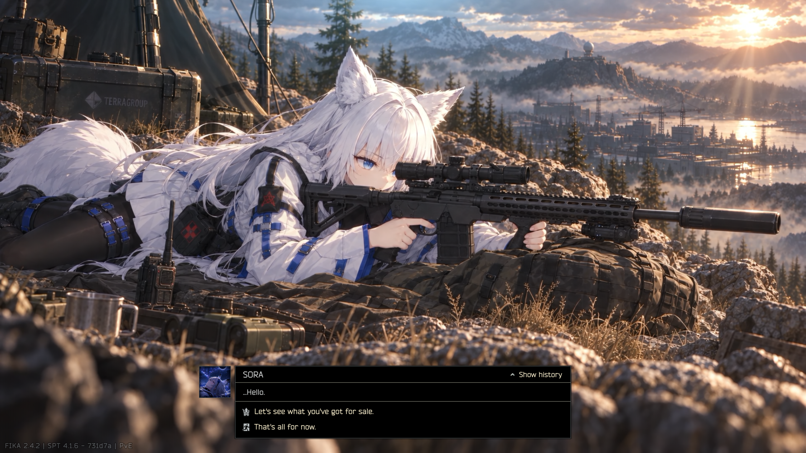

# VisitAPI

**English** | [简体中文](README.zh-CN.md)

An open-source framework that brings EFT 1.x-style trader **Visit** dialogues to SPT — write plain-text `.dlg` scripts to give any trader (including custom traders) a 3D room conversation, story chapters, standing rewards, quest zones and in-raid dialogue triggers. Content ships as drop-in **packs**; the EFT 1.1 main story with the trader rooms is one such pack.

> Target: **SPT 4.1.x** (4.1.0 or newer 4.1 release, EFT 0.16.9) · Client: BepInEx 5.4.23 plugin (net472) · Server: SPT mod (net10.0) · Fika-compatible · Current version **1.3.4**



## Features

- **Visit button** — a retail-style "Visit" tab on the trader screen that opens a 3D room conversation
- **Trader rooms** — the 1.1 rooms of seven vanilla traders (Prapor, Therapist, Fence, Skier, Mechanic, Ragman, Jaeger) with lip-sync, animations, ambient audio and the retail loading screen; they come with the EFT11 add-on (see Install)
- **.dlg scripts** — nodes, options, condition gates (level / standing / quest state / `ifitems`), branch memory (`set:` / `ifvar:`), one-shot options (`once` / `always` / `first`), image / video / 3D-scene backgrounds, voice + BGM, standing rewards (`standing:`), quest transitions (`accept:` / `complete:` / `handover:` / `setstatus:`)
- **Several languages in one script** — put `en: translation` on the line right under any displayed line; the game shows the translation for its language and falls back to the original. All 17 SPT language codes work
- **Native narrate pipeline** — vanilla traders run on EFT's built-in visit system with retail dialogue playback (lip-sync, subtitles and branching variables are native), including the 1.1 key-decision confirmation window
- **Quest system** — quest JSON in packs with fully native network transactions (accept / handover / complete), quest images, quest items with 3D models and their raid spawn points
- **Quest zones** — `zones\*.json` in a pack places visit and item-placement zones at map coordinates; they are created as the game's own triggers when a raid starts, optionally with in-raid subtitles, voice and an interaction prompt
- **In-raid & hideout triggers** — `trigger:` lines place dialogue points at map coordinates (distance + view cone + quest gating), or fire on a timer with `enter <seconds>`; `once` makes a trigger fire only once per profile
- **Timed trader contact** — a story quest whose prerequisite carries `availableAfter` waits for the timer, then the 1.1 gold phone badge lights up on the trader's card and next to your name; talk to the trader to take the quest
- **Chat invites** — as in 1.1, a trader writes to you in chat when a story quest becomes available; the letter's Visit button takes you to the trader's room, and Reply opens the conversation on the spot, with voice and subtitles, for contacts that have no room (the radio, the laptop)
- **Traders in packs** — a pack can add traders of its own (base file, avatar, names in every language) together with the voice lines of their dialogues
- **Native subtitle narration** — `>` narration lines play in the game's own subtitle bar; click or press Space to advance
- **Quest banners** — quest started / ready / completed / failed announced on retail-style banners riding the vanilla notification pipeline, queued one after another
- **Chapter system (STORY tab)** — the retail 1.1 story page: chapter icon column, banner, main / optional objectives, journal with per-note related items, unread markers, chapter banners and sounds, multiple endings; the official 1.1 chapters keep their fixed places and your own chapters sort after them (or where their `order` puts them); story quests stay out of the side-quest and trader lists; read state is stored in the profile
- **Story-gated traders and maps** — traders unlocked by a story quest start locked on new profiles; a quest can unlock maps (experimental, new profiles only)
- **Progress persistence** — dialogue variables and 1.1-style variable groups are replayed server-side into the profile and survive across sessions
- **Content packs** — everything the server mod loads lives in `packs\<pack>\` with a `pack.json`; drop a folder in and it loads, remove it and it is gone; conflicts between packs are reported by name at startup

## Script editor

**[VisitAPI Editor](https://github.com/TricolourSky/VisitAPI-Editor)** is the official companion tool — a local web-based visual editor for `.dlg` scripts, quests and chapters, with language tabs, live preview and validation rules built from this framework's pitfalls. It ships inside the framework package. Start there instead of writing scripts by hand.

## Install

1. Grab the packages from [Releases](https://github.com/TricolourSky/VisitAPI/releases):
   - `VisitAPI-x.y.z.zip` — client plugin + server mod + `VisitAPI.Editor.exe`. **Required.** Extract into your SPT root. It deliberately contains **no** scripts, quests, rooms or texts — only the folders they go in. The editor lands next to `EscapeFromTarkov.exe`; double-click it and it opens in your browser (binds to 127.0.0.1 only).
   - `VisitAPI-EFT11-x.y.z.zip` — the **EFT11 add-on**: the EFT 1.1 main story (Tour of Tarkov, Falling Skies, The Labyrinth) together with the seven 3D trader rooms and the retail trader dialogues. Optional. At about 4 GB it is too big for GitHub, so it is hosted separately; the release notes link to it. Extract it into the SPT root like the framework. Without it, custom `.dlg` scripts still work with image / video backgrounds, but the Visit button of a vanilla trader has no room to open.
2. Put your `.dlg` scripts into `<SPT>\BepInEx\config\VisitAPI\<traderId>.dlg`; backgrounds and audio go into `backgrounds\` and `audio\` next to them.
3. Quests, texts, zones and images of your own go into a pack: `<SPT>\SPT_Runtime\user\mods\VisitAPI-Server\packs\<any name>\` (the editor creates one for you).

**Upgrading from 1.3.3:** extract the new framework zip over the game folder, then the EFT11 add-on 1.1.0 over the old add-on (1.1.0 adds The Labyrinth and needs framework 1.3.4). The settings page now has three options (see Configuration).

**Upgrading from 1.3.2 or older:** extract the new framework zip over the game folder, then move `VisitAPI-Server\db\`, `images\` and `bundles\` into `VisitAPI-Server\packs\<any name>\` (see the layout below), and rename `BepInEx\plugins\VisitAPI\bundles\` to `ui\` and `scenes\bundles\vendors\` to `rooms\`. The old places are still read in 1.3.x, with a warning in the log. If you had the experimental 1.1 story data in `db\`, delete it and install the EFT11 add-on instead.

## Content packs

One pack = one folder under `SPT_Runtime\user\mods\VisitAPI-Server\packs\`:

```
packs\<pack>\
  pack.json          name, version, requires (e.g. "~1.3.4"), author, description {ch, en}
  LICENSE            optional, for published packs
  quests\*.json      SPT quest files (chapters are quests with a few switches, see below)
  locales\<lang>.json  quest texts, journal entries, objective hints, names of the pack's traders
  dialogues\*.json   retail-format dialogues for the native narrate pipeline
  traders\<id>\      traders the pack adds: base.json + avatar.png (skipped if the server already has that trader)
  voice\<trader id>\ voice lines (.ogg / .wav / .mp3) for dialogues of traders without a room; file name = the voice id the dialogue uses
  zones\*.json       quest zones (map, position, size, optional subtitles)
  items\*.json       quest item templates; loot\*.json their raid spawn points
  bundles\ + bundles.json   Unity bundles for those items
  variables\groups.json     1.1 variable groups (a group's value is the sum of its members)
  images\banners\    quest banners (quest `image`, served as /files/quest/icon/<name>)
  images\icons\      chapter icons (`visitapi.icon`, served as /files/quest/chapters_icon/<name>)
```

Packs load in name order. Two packs carrying the same quest, zone, item, image or text key are reported in the server log and the first one wins. `requires` is checked against the framework version (`~1.3.4` = any 1.3.x from 1.3.4 up); a mismatch is logged but the pack still loads. The client-side files of a pack live in `BepInEx\plugins\VisitAPI\rooms\` (trader rooms) — the framework's own UI bundles are in `ui\` next to it.

## Build from source

You need a local SPT 4.1.x install (for the reference DLLs) and the [VisitAPI Editor](https://github.com/TricolourSky/VisitAPI-Editor) repository checked out next to this one in a folder named `VisitAPI Editor`. Two pieces of shared source are compiled in from there rather than referenced as DLLs: the `.dlg` parser (`src/VisitAPI.Dlg`) and the pack layout (`src/VisitAPI.Packs`). Both sides must agree byte for byte on what a script or a pack means, so change them there and rebuild both.

```
dotnet build Client\VisitAPI.csproj        -c Release -p:EftDir=<your SPT dir> [-p:DlgSrc=<VisitAPI.Dlg source dir>]
dotnet build Server\VisitAPI-Server.csproj -c Release -p:SptDir=<your SPT dir>\SPT_Runtime [-p:PacksSrc=<VisitAPI.Packs source dir>]
```

When the game directory exists the build auto-deploys the DLLs (`-p:SkipDeploy=true` to skip; the server must not be running). Not in this repository, taken from a release package instead: the two UI bundles (`BepInEx\plugins\VisitAPI\ui\*.bundle`; the client build copies them from `content\ui\` when present) and a few embedded images and sounds extracted from the game (effect textures, 1.1 badges, the key-decision window art, the 1.1 chat window art, intercom voices). The plugin builds and runs without them — each missing piece logs a warning and its visual falls back or is skipped.

## .dlg quick start

```
trader: 5ac3b934156ae10c4430e83c "Example Trader"
  en: Example Trader
start: root

<root> bg: room.png
> Narration - plays in the game's own subtitle bar.
  en: Narration - plays in the game's own subtitle bar.
You made it. What do you need?
- Show me your stock. -> @trade
- Got any work for me? -> @tasks
- Nothing, I'm off.
```

Name the file after the trader's 24-hex id and drop it in `BepInEx\config\VisitAPI\`. A translation line is `<code>: text` right under the line it translates (indent as you like; codes: `ch cz en es es-mx fr ge hu it jp kr pl po ro ru sk tu`); lines without one show the original. The full syntax (gates, triggers, quests, standing, media) is documented inside the editor.

## Chapter system (STORY tab)

A chapter is an ordinary quest JSON with a few switches; its "complete quest" objectives are the list of sub-quests:

```json
"visitapi": { "chapter": true, "icon": "/files/quest/chapters_icon/ch1.png", "order": 1 },
"image": "/files/quest/icon/ch1_banner.png",
"notes": { "Started": "<24-hex note id>", "Success": "<24-hex note id>" },
"conditions": { "AvailableForFinish": [
  { "conditionType": "Quest", "target": "<sub-quest A id>", "status": [4], "id": "<24-hex>", "index": 0 },
  { "conditionType": "Quest", "target": "<sub-quest B id>", "status": [4], "id": "<24-hex>", "index": 1 }
] }
```

- The chapter starts when any sub-quest starts and is turned in automatically once all sub-quests are done (mail and rewards go through the native pipeline); a sub-quest marked as an ending finishes the chapter, and there can be several
- `notes`: a journal entry unlocks at Started / Success / Fail; an objective can also carry `questNoteId` (unlocks the moment that objective is ticked). Journal text lives in the locale under the note id
- Sub-quest switches under `visitapi`: `autoStart` (accepted once the chapter has started and its own prerequisites are met; a sub-quest without a quest prerequisite also waits until the entry before it in the chapter's list has ended), `autoFinish` (turned in as soon as its objectives are met), `startAfter` (a quest id or a list of them: the quest is accepted once any one of them is completed), `anyOf` (`true`, or a list of objective ids: any one of them completes the quest), `items` (related item template ids; `craft:` / `offer:` prefixes mark the type), `noteLinks` (related items per journal entry), `unlockTraderOnReady` (the trader unlocks when the quest becomes ready), `setVariables` (`{ "Started" / "Success" / "Fail": { "<variable id>": value } }`: profile variables set when the quest reaches that status, like the 1.1 GlobalVariable rewards)
- Chat invite: give a quest 1.1's `mailSettings` (`isEnabled`, `fromTraderId`, `entryPoint`, `dialogueId`, `dialogueTraderId`) and the locale text `<quest id> whileAvailableMessageText`; when the quest becomes available that trader sends the letter, once per profile. `entryPoint` `InLobby` gives it a Visit button (the trader's room), `ViaRadio` / `ViaNotebook` a Reply button (the dialogue opens on the spot)
- `unlockDialogue`: a list of trader ids whose Visit button opens only after this quest is completed; `unlockLocations`: maps unlocked by this quest (new profiles only)
- `order`: sort position of your own chapter on the STORY page, smaller first (the official 1.1 chapters are fixed at 1–9; without `order` the `CustomChapterOrder` setting applies, default 100); `dialogOnly`: the task list button becomes "VISIT X" so accepting and handing in go through dialogue only
- Top-level `isStoryQuest` marks a 1.1 story quest: a completion mail without item rewards is not sent for it; `notDisplayedQuest` hides a quest from the lists
- Objective texts in the locale: `<condition id> desc` (small print), `<condition id> talk` (which row shows the "go and see X" button and what it says)
- A failed sub-quest does not fail the chapter; give the chapter's "complete quest" condition `"status": [4, 5, 6]` to let a written-off sub-quest count as done
- Banners go into the pack's `images\banners\`, chapter icons into `images\icons\`; every id must be 24 hex characters
- To put story quests back into the regular lists, turn off `HideStoryQuestsInLists` in `BepInEx\config\com.sora.visitapi.cfg`

The editor writes all of this for you; the list above is for reading files by hand.

## Configuration

`BepInEx\config\com.sora.visitapi.cfg` has three settings, all in the `Chapter` section:

| Key | Default | What it does |
|---|---|---|
| `ShowUnstartedChapters` | `false` | also show chapters that have not started yet on the STORY page |
| `CustomChapterOrder` | `100` | sort position of your own chapters on the STORY page, smaller first (a chapter's own `order` wins); the official 1.1 chapters are fixed at 1–9 |
| `HideStoryQuestsInLists` | `true` | keep story quests out of the regular quest and trader lists |

Everything else is fixed: the interface and `.dlg` translations follow the game's language, the visit camera and lighting use the 1.1 look, and the 1.1 trader card badges and chat invites are always on. For trigger authoring, press **F11** in the hideout or in a raid: `BepInEx\LogOutput.log` gets a `[coord] (x, y, z)  location=…` line with the camera position. Apart from that line, VisitAPI writes to the logs only when something goes wrong.

## Contributing

Bug reports, feature requests and pull requests are welcome — see [CONTRIBUTING.md](CONTRIBUTING.md). Please do not attach game files, decompiled sources or extracted assets to issues or pull requests.

## Disclaimer

This repository contains **no BSG game assets**. The trader rooms, the retail dialogue data and the EFT 1.1 story data are distributed separately as the EFT11 add-on (its data and tools: [Storyline-Backport](https://github.com/TricolourSky/Storyline-Backport)). Not affiliated with Battlestate Games or the SPT team.

## License

MIT (see [LICENSE](LICENSE)).
